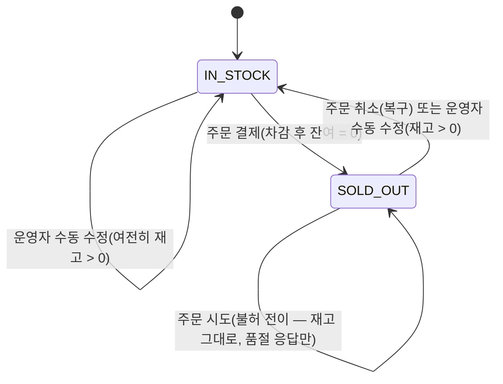
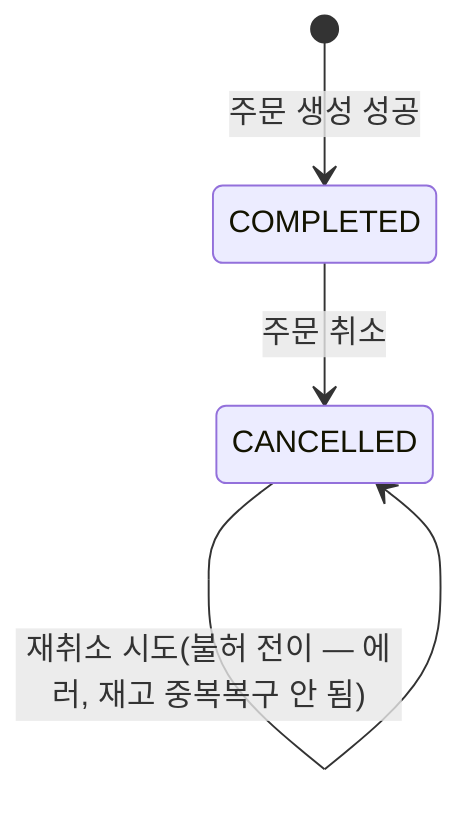

# 테스트 케이스 설계서 — B마트 재고 API

이 문서는 [문제2](README.md)의 테스트 케이스를 어떤 블랙박스 테스트 설계기법으로 도출했는지 정리한다. 기법을 나열하는 데 그치지 않고, **각 기법이 어떤 입력/동작 특성에 적합한지 구분해서 적용**했고, 서로 다른 기법이 같은 취약점을 다른 각도에서 짚어내는 지점도 함께 표시했다.

실제 테스트케이스 목록(입력값/사전조건/예상결과 상세)은 [TEST_CASES.md](TEST_CASES.md)에 별도로 정리했다. 이 문서의 표에 있는 **ID가 그 파일의 ID와 동일**하다.

| 기법 | 적용 대상 |
|---|---|
| 상태 전이 테스트 (State Transition) | 재고 상태(IN_STOCK/SOLD_OUT), 주문 상태(COMPLETED/CANCELLED) — **순서가 있는 상태 변화** |
| 경계값 분석 (Boundary Value Analysis) | 주문 수량(quantity) — **순서가 있는 숫자 값** |
| 동등 분할 (Equivalence Partitioning) | productId, orderId — **순서가 없는 범주형 값** |
| 결정 테이블 (Decision Table) | "운영자 수정 중 주문 발생" — **조건 2개 이상이 조합되는 상황** |
| 동시성 테스트 (별도 범주) | 동일 조건이 실제로 "동시에" 도달했을 때의 타이밍 이슈 — 위 4개 기법과는 성격이 다른, 비기능적 검증 |

## 1. 상태 전이 테스트 (State Transition Testing)

재고와 주문은 서로 다른 생명주기를 가진 별개의 엔티티라, 다이어그램을 두 개로 분리했다.

### 1-1. 재고(Product Stock) 상태

### 1-2. 주문(Order) 상태

> 참고: "재고 부족으로 주문이 거절된 경우"는 이 다이어그램에 없다. Order 엔티티 자체가 생성되지 않는 케이스라 "상태 전이"가 아니라 "입력에 따른 생성 성공/실패" 문제이며, 이는 경계값 분석/동등 분할로 다룬다.

### 커버리지 매트릭스

| ID | 전이 | 테스트 함수 | 상태 |
|---|---|---|---|
| TC-03/TC-04 | IN_STOCK → IN_STOCK (여유 재고 주문) | `test_tc03_order_decrements_stock`, `test_tc04_order_multiple_quantity` | ✅ 기존 |
| TC-07 | IN_STOCK → SOLD_OUT (경계 전이) | `test_tc07_stock_zero_becomes_soldout` | ✅ 기존 |
| TC-06 | SOLD_OUT → IN_STOCK (취소로 복구) | `test_tc06_cancel_then_other_customer_can_repurchase` | ✅ 기존 |
| TC-18 | SOLD_OUT → IN_STOCK (운영자 수동 수정으로 복구) | `test_tc18_admin_restocks_soldout_product` | 🆕 신규 |
| TC-08 | SOLD_OUT → SOLD_OUT (불허 전이) | `test_tc08_order_on_soldout_is_rejected` | ✅ 기존 |
| TC-05 | (없음) → COMPLETED → CANCELLED | `test_tc05_cancel_restores_stock` | ✅ 기존 |
| TC-14 | CANCELLED → CANCELLED (불허 전이) | `test_tc14_cancel_twice_rejected` | ✅ 기존 |

## 2. 경계값 분석 (Boundary Value Analysis)

quantity는 두 개의 경계를 갖는다 — 하나는 **고정 경계**(하한 1), 다른 하나는 **동적 경계**(상한이 그때그때의 `stock` 값 자체).

### 2-1. quantity 하한 (고정 경계)

| ID | 값 | 위치 | 기대 결과 | 테스트 함수 | 상태 |
|---|---|---|---|---|---|
| TC-16 | -1 | 하한 미만 | 400 INVALID_QUANTITY | `test_tc16_order_negative_quantity_rejected` | 🆕 신규 |
| TC-11 | 0 | 하한 경계값 | 400 INVALID_QUANTITY | `test_tc11_order_zero_quantity_rejected` | ✅ 기존 |
| TC-03 | 1 | 하한 바로 위 | 201 성공 | `test_tc03_order_decrements_stock` | ✅ 기존 |

### 2-2. quantity vs stock 상한 (동적 경계, stock=N 기준)

| ID | 값 | 위치 | 기대 결과 | 테스트 함수 | 상태 |
|---|---|---|---|---|---|
| TC-04 | N-1 | 상한 미만 | 201 성공, 재고 여유 | `test_tc04_order_multiple_quantity` | ✅ 기존 |
| TC-07 | N (정확히 소진) | **상한 경계값** | 201 성공, 재고=0, SOLD_OUT 전환 | `test_tc07_stock_zero_becomes_soldout` | ✅ 기존 (상태전이 TC-07과 동일 지점) |
| TC-17 | N+1 | 상한 바로 초과 | 409 SOLD_OUT | `test_tc17_order_one_over_stock_rejected` | 🆕 신규 |
| TC-09 | N+100 | 상한 훨씬 초과(극단값) | 409 SOLD_OUT | `test_tc09_order_far_exceeds_stock_rejected` | ✅ 기존 |

> `quantity = N`(TC-07, 경계값)이 1장 상태 전이 다이어그램의 `IN_STOCK → SOLD_OUT` 트리거와 정확히 같은 지점이다 — 경계값 분석과 상태 전이 테스트가 서로 다른 각도에서 같은 취약점을 짚는다.

### 2-3. stock 자체의 경계

| ID | stock 값 | 상황 | 테스트 함수 | 상태 |
|---|---|---|---|---|
| TC-08 | 0 | 이미 품절 상태에서 주문 시도 | `test_tc08_order_on_soldout_is_rejected` | ✅ 기존 |
| TC-07, TC-23~25 | 1 | 마지막 재고 (동시성 시나리오의 전제) | `test_tc07_stock_zero_becomes_soldout`, 5장 동시성 테스트 전체 | ✅ 기존 |

## 3. 동등 분할 (Equivalence Partitioning)

quantity는 경계값 분석의 클래스 경계와 완전히 겹쳐 별도로 다룰 게 없다는 걸 먼저 확인했다. 대신 **순서 개념이 없는 범주형 입력**(productId, orderId)에 적용했다.

### 3-1. productId — 2개 클래스

| ID | 클래스 | 테스트 함수 | 상태 |
|---|---|---|---|
| TC-01 | 유효 (존재하는 상품) | `test_tc01_get_current_stock` 외 다수 | ✅ 기존 |
| TC-12, TC-13 | 무효 (존재하지 않는 상품) | `test_tc12_unknown_product_stock_404`, `test_tc13_order_unknown_product_404` | ✅ 기존 |

### 3-2. orderId(취소 대상) — 3개 클래스

| ID | 클래스 | 테스트 함수 | 상태 |
|---|---|---|---|
| TC-05 | 유효 (존재 + 아직 취소 안 됨) | `test_tc05_cancel_restores_stock` | ✅ 기존 |
| TC-15 | 무효① (존재하지 않는 주문) | `test_tc15_cancel_unknown_order_404` | ✅ 기존 |
| TC-14 | 무효② (이미 취소된 주문) | `test_tc14_cancel_twice_rejected` | ✅ 기존 |

## 4. 결정 테이블 (Decision Table)

'재고 처리 규칙' 표의 비고 — "운영자 수정 중 주문 발생 시 처리 순서 정의 필요" — 를 조건 2개의 조합으로 풀었다.

- **조건 1**: 처리 순서 — [운영자 수정 먼저] / [주문 먼저] (락으로 인해 둘 중 하나가 반드시 먼저 처리됨)
- **조건 2**: 그 처리 시점의 재고가 주문 수량 이상인가 — [예] / [아니오]

| ID | Rule | 처리 순서 | 재고 ≥ 주문수량? | 주문 결과 | 최종 재고 | 테스트 함수 | 상태 |
|---|---|---|---|---|---|---|---|
| TC-19 | R1 | 운영자 수정 → 주문 | 예 | 성공(201) | 수정값 − 주문수량 | `test_tc19_admin_restock_then_order_succeeds` | 🆕 신규 |
| TC-20 | R2 | 운영자 수정 → 주문 | 아니오 | 품절(409) | 수정값 그대로 | `test_tc20_admin_low_stock_then_order_rejected` | 🆕 신규 |
| TC-21 | R3 | 주문 → 운영자 수정 | 예 | 성공(201) | **운영자 지정값** (주문 결과와 무관하게 덮어써짐) | `test_tc21_order_then_admin_overwrites_stock` | 🆕 신규 |
| TC-22 | R4 | 주문 → 운영자 수정 | 아니오(품절) | 품절(409) | **운영자 지정값** | `test_tc22_failed_order_then_admin_sets_stock` | 🆕 신규 |

R3/R4에서 최종 재고가 항상 "운영자 지정값"인 이유는, 우리 서버 구현이 운영자 수정을 **절대값 지정**(상대적 증감이 아님)으로 설계했기 때문이다 — 결정 테이블을 만들어보니 이 설계 선택의 함의가 명확하게 드러난다.

> 이 결정 테이블은 "처리 순서가 정해졌을 때 규칙대로 결과가 나오는가"를 검증한다(그래서 API를 순차 호출하는 것만으로 테스트 가능). "실제로 동시에 요청이 왔을 때 이 규칙대로 흘러가는가"는 5장의 동시성 테스트가 별도로 검증하는 영역이다.

## 5. 동시성 테스트 (별도 범주)

위 4개 기법은 "입력값이나 순서가 정해졌을 때 결과가 규칙대로 나오는가"를 다루지만, 동시성 테스트는 **"실제로 타이밍이 겹칠 때도 규칙이 깨지지 않는가"** 를 다루는, 성격이 다른 비기능 테스트다. 자세한 설계는 [README.md의 동시성 테스트 설계](README.md#동시성-테스트-설계-핵심) 참고.

과제가 명시한 "재고 1개 남은 상품에 두 요청이 수십 ms 간격으로 도달"하는 시나리오를 직접 재현하는 것은 **TC-23**이다.

| ID | 테스트 함수 | 검증 내용 |
|---|---|---|
| TC-23 | `test_tc23_concurrent_orders_on_last_unit` | **과제가 명시한 시나리오 그 자체** — 실제 타이밍 재현(Barrier), 결과만 엄격 검증 |
| TC-24 | `test_tc24_lock_serializes_under_artificial_delay` | 인위적 지연으로 락 경합을 강제해 결정적으로 재검증 |
| TC-25 | `test_tc25_no_oversell_under_high_concurrency` | 10건 동시 요청에도 오버셀 없음 (강도를 높인 추가 검증) |

## 6. 요구사항 대비 커버리지 요약

과제 요구사항 "정상 케이스, 재고 복구, 품절 전환을 포함한 10개 이상"에 대한 카테고리별 매핑. 상세 근거는 [TEST_CASES.md](TEST_CASES.md)의 "요구사항 카테고리" 열 참고.

| 요구사항 카테고리 | 해당 ID |
|---|---|
| 정상 케이스 | TC-01, TC-02, TC-03, TC-04, TC-10, TC-19 |
| 재고 복구 | TC-05, TC-06, TC-18 |
| 품절 전환 | TC-07, TC-08, TC-09, TC-17, TC-20 |
| 예외 처리(그 외) | TC-11, TC-12, TC-13, TC-14, TC-15, TC-16 |
| 결정 테이블(복합 조건) | TC-21, TC-22 |
| 동시성 | TC-23, TC-24, TC-25 |

**총 25개** (요구사항 최소치인 10개를 크게 상회) — 4개 설계기법 + 동시성 검증을 조합한 결과다.
