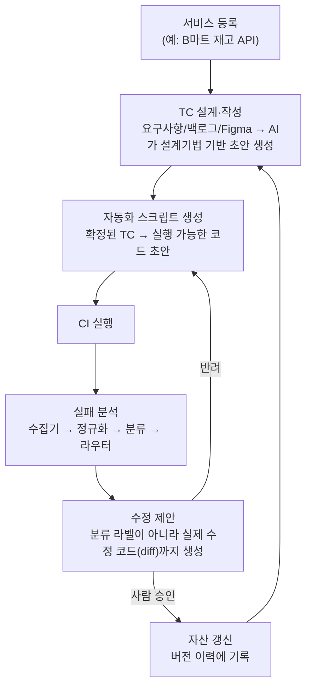

# 문제4. AI 생성 코드 검증 자동화 — 제안: TestLedger (테스트케이스 자산화 플랫폼)

**[TestLedger 목업 바로 보기](https://YeongjunLim.github.io/qa-automation-assignment/problem4-ai-qa-tool/prototype/testledger.html)** (GitHub Pages)

## 핵심 아이디어를 한 줄로

**테스트케이스를 "누군가 짜고 방치되는 파일"이 아니라, 서비스별로 등록·설계·실행·수정까지 이어지는 조직의 관리 자산으로 다루는 AI 보조 플랫폼.**

## 왜 이 아이디어인가

실무에서 이미 AI로 테스트 스크립트를 짜고 있지만, 지금 방식은 "AI가 짜준 걸 돌려보고, 에러 나면 사람이 고치는" **반응적(reactive) 루프**에 머물러 있다. 이 루프의 한계는:

- 에러(실행 실패)는 잡아내지만, **품질 결함**(고정 대기, 취약한 셀렉터, 약한 assertion처럼 "돌아가긴 하는데 나쁜 코드")은 여전히 사람이 눈으로 봐야 잡힌다.
- 테스트케이스 하나하나가 **왜 존재하는지, 어떤 요구사항과 연결되는지**가 기록되지 않아, 시간이 지나면 "지워도 되는지 판단이 안 서는 파일 더미"가 된다 ([문제3](../problem3-e2e-refactor)에서 지원자가 직접 발견한 문제와 동일한 근본 원인).
- 실패가 나면 그때그때 사람이 로그를 보고 분류하는데, 이 과정 자체가 매번 반복되는 소모적 작업이다.

이 세 가지를 각각 다른 도구로 풀면 파편화된다. **"테스트케이스 자산화"** 라는 목적 하나로 묶으면, 등록→설계→작성→실행→분석→수정→자산 갱신이 하나의 순환 고리가 된다.

JD와도 맞닿는 지점이 많다 — "자동화 커버리지·실행 안정성(Flakiness) 등 **품질 지표 정의 및 관리**", "품질을 수치로 측정하고 **해결 방향까지 제안**", "QA 생산성 향상을 위한 **내부 도구 개발**", 우대사항의 "**테스트 생성**, **자가 치유 스크립트**" 경험까지 — 이 플랫폼의 각 단계가 이 문구들에 하나씩 대응한다.

## 아키텍처

핵심 원칙: **어느 단계든 최종 확정은 사람이 한다.** AI는 초안·분류·수정 후보를 만들 뿐, 자동으로 자산에 반영하지 않는다.

## 단계별 구현 상태 — "설계만"과 "실제로 돌려본 것"을 구분

| 단계 | 상태 | 근거 |
|---|---|---|
| 실패 분석 (수집기→정규화→분류→라우터) | ✅ **실제 실행 검증** | [`prototype/flaky_triage.py`](prototype/flaky_triage.py) — 5개 카테고리(ENV/TIMING/TEST_DEFECT/DATA/REAL_BUG) 분류, 실제 4건 샘플에 대해 로컬 실행 확인. 규칙 기반 폴백 + LLM 모드 지원 |
| TC 설계·작성 (Generator/Critic) | ✅ **실제 서브에이전트로 실행 검증** | [`.claude/agents/tc-generator.md`](../.claude/agents/tc-generator.md), [`tc-critic.md`](../.claude/agents/tc-critic.md) — 실제로 Claude Code sub-agent를 호출해 쿠폰 기능 TC를 2라운드 생성·검토한 기록: [`prototype/subagent_demo_coupon.md`](prototype/subagent_demo_coupon.md) |
| 수정 코드 제안 (Self-healing) | 🎨 설계 + UI 목업 | 실제 코드 생성 호출은 하지 않음. TestLedger 목업의 "수정 제안" 화면에 문제3의 `Thread.sleep` 사례를 실제 diff 형태로 표현 |
| 서비스 등록 / 자산 이력 관리 | 🎨 설계 + UI 목업 | TestLedger 목업의 "대시보드" / "자산 이력" 화면 |

## 프로토타입: TestLedger (정적 HTML 목업)

[`prototype/testledger.html`](prototype/testledger.html) — 다운받아 브라우저로 열면 바로 확인 가능한 5화면 목업. 새로 지어낸 가짜 데이터가 아니라 **이 과제에서 실제로 만들어낸 결과물을 그대로 샘플로 사용**했다.

| 화면 | 내용 |
|---|---|
| 대시보드 | 등록된 서비스(B마트 재고 API 등) 현황, TC 자산 수, 최근 CI 결과, 활동 로그 |
| TC 설계·작성 | 쿠폰 기능 요구사항 + 실제 Generator↔Critic 2라운드 검토 타임라인 + 생성된 TC 표 |
| CI 실패 분석 | `flaky_triage.py`로 실제 분류한 4건의 결과 |
| 수정 제안 | [문제3](../problem3-e2e-refactor)의 `Thread.sleep(5000)` → 폴링 대기 코드로 바꾸는 diff 목업, 적용/반려 버튼 |
| 자산 이력 | 서비스 등록부터의 변경 이력 로그 |

## Sub-agent 설계에 대한 정직한 메모

`tc-generator`/`tc-critic`을 Claude Code의 `.claude/agents/*.md` 커스텀 sub-agent로 정의했지만, **세션 재시작 없이는 방금 만든 커스텀 타입이 즉시 인식되지 않는다는 걸 실제로 시도해보고 확인했다** (`Agent type 'tc-generator' not found`). 그래서 실제 데모는 이미 등록된 범용 타입에 두 정의 파일의 역할을 프롬프트로 그대로 주입해 실행했다 — 정의 파일 자체는 실제 배포 환경(세션 재시작 후, 또는 팀 전체가 공유하는 `.claude/agents/`)에서 그대로 쓸 수 있는 형태로 남겨뒀다. 이 과정과 판단 근거는 [PROCESS.md](PROCESS.md)에 상세히 기록했다.

## 신뢰성 확보 방안

- **출력 스키마 고정**: 분류/TC 결과 모두 정해진 형식(JSON 또는 표)으로 강제, 파싱 실패 시 규칙 기반 폴백
- **근거(evidence) 필수화**: 왜 그렇게 분류/지적했는지 항상 함께 출력
- **자동 확정 금지**: TC 승인도, 수정 코드 적용도 사람이 눌러야 확정됨 — 이번 데모에서 AI가 2라운드 모두 스스로 "반려"를 선택한 것 자체가, 자동 확정이 없었기에 가능했던 안전장치였다
- **신뢰도 낮으면 보수적으로**: 분류 신뢰도가 낮으면 카테고리를 확정하지 않고 사람 확인 큐로

## AI 도구 활용 내역
[최상위 README](../README.md#ai-도구-활용-내역)에 통합 기재. 이 문제는 특히 Claude Code의 sub-agent 기능(`Agent` 도구)을 실제로 호출해 Generator/Critic 루프를 실행하고, 그 결과를 가공 없이 [`subagent_demo_coupon.md`](prototype/subagent_demo_coupon.md)에 기록했다.

## 이 아이디어를 만든 과정
지원자와 Claude가 이 결론에 도달하기까지 여러 대안(코드 검증 자동화, 요구사항 전체 생애주기 시스템 등)을 검토하고 좁혀나간 과정은 [PROCESS.md](PROCESS.md)에 정리했다.
